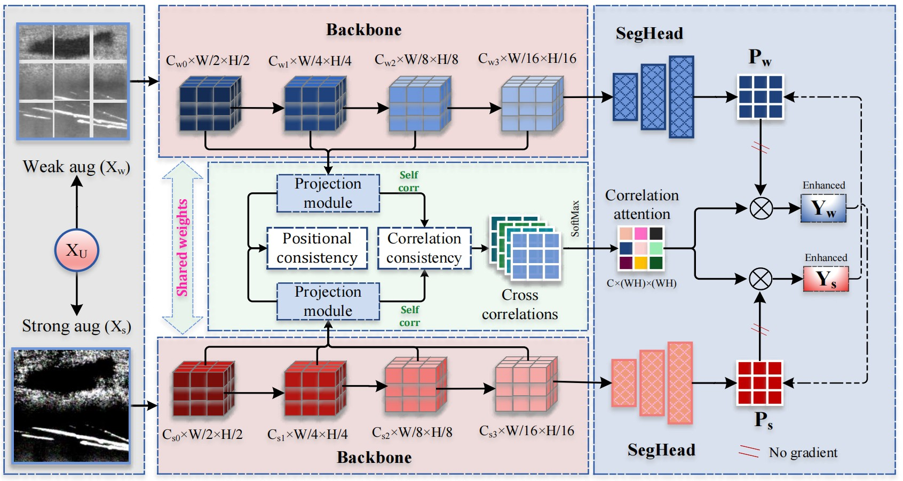
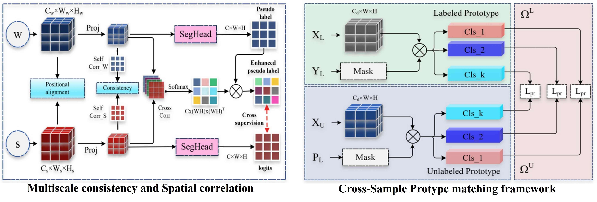
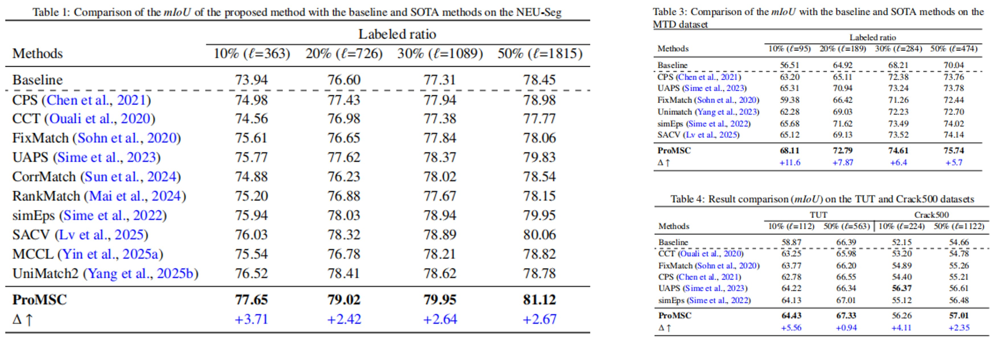
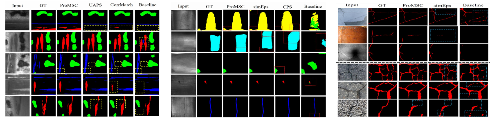

# Cross-Sample Prototype Matching and Multiscale Spatial Correlation Consistency for Defect Segmentation Under Limited Annotations

[]()
[]()
[]()

## 📄 Abstract

Defect segmentation is critical a task in industrial quality control and manufacturing systems, yet acquiring pixel-level annotations for training deep learning models is costly and time-consuming. Existing semi-supervised methods often struggle with challenges in industrial images, including low contrast, pixel-level class ambiguity, and extreme defect variability, which lead to prediction noise and biases when labeled samples are limited. To address these issues, we propose **ProMSC** (Cross-Sample Prototype Matching with Multiscale Spatial Correlation Consistency), a novel semi-supervised framework that leverages a small set of annotated samples to guide learning from unlabeled data. ProMSC integrates cross-sample prototype matching between labeled and unlabeled samples at the feature map level to improve the representation of unlabeled samples, multiscale spatial correlation and positional alignment to enforce structural consistency between weakly and strongly augmented views, and pseudo-label refinement via correlation matrix to enhance prediction confidence. This combination effectively mitigates the challenges of low contrast, class ambiguity, and extreme defect variability, enabling robust learning from limited labeled data along with large pool of unlabeled data. Extensive experiments on five benchmark defect segmentation datasets demonstrate that ProMSC outperforms several state-of-the-art semi-supervised segmentation approaches.

# 🚀 Full paper source:
Details and specific analysis is found at : (https://www.sciencedirect.com/science/article/pii/S095741742602213X)

⭐ [Please Star this repo](https://github.com/djene-mengistu/ProMSC)
🔥 If you find it useful, please cite ourwork as follows:
```
@ARTICLE{djene-ProMSC,
  author={Dejene M. Sime, Nan Ouyang, Kai Sheng, Adnan A. Qaseem, Yiting Liu, Xiaojiang Renb},
  journal={Expert Systems with Applications}, 
  title={Cross-Sample Prototype Matching and Multiscale Spatial Correlation Consistency for Defect Segmentation Under Limited Annotations}, 
  year={2026},
  keywords={Defect segmentation; Semi-supervised learning; Multi-scale spatial correlation; Cross-sample prototypes; Pseudo-labeling; Consistency regularization},
  doi={https://doi.org/10.1016/j.eswa.2026.133304}}
```
## 🚀 Usage of this repository:
This repository provides scripts for training, evaluation, and segmentation using the ProMSC framework.  
Follow the steps below to reproduce the results.

1️⃣ Train ProMSC: run the 'train.sh'

2️⃣ Evaluate ProMSC: run the 'test.py'

3️⃣ Segmentation Pipeline: create the pseudo labels from the seed CAM and run the codes in the 'Segmentation directory'

4️⃣ Apply to Different Datasets: Follow same procedure for all datasets

---


# 📌 Overview

Defect segmentation is essential for industrial quality control, yet it faces major challenges due to the high cost and time required for pixel-level annotations. Industrial images often suffer from low contrast, pixel-level class ambiguity, extreme defect variability (in size, shape, and appearance), class imbalance, and subtle textures. These issues cause noisy pseudo-labels, confirmation bias, and error propagation in traditional semi-supervised learning (SSL) methods, which struggle with limited labeled data while relying on abundant unlabeled samples.

## 🧩Proposed Solution: ProMSC Framework
This paper introduces ProMSC, a novel semi-supervised framework designed to address these limitations by tightly coupling pseudo-labeling with enhanced consistency regularization:

- ⚡Cross-Sample Prototype Matching🧬: Builds class-wise prototypes from labeled samples (using ground-truth masks) and unlabeled samples (using pseudo-labels) at the feature-map level. This anchors unlabeled representations to reliable semantic centers from labeled data, promotes compact intra-class clustering, and pushes decision boundaries toward low-density regions to improve pseudo-label quality and reduce confirmation bias.
- ⚡Multiscale Spatial Correlation Consistency🌊: Computes spatial correlation matrices at multiple encoder scales to capture higher-order structural relationships (beyond local pixels). These are enforced to remain consistent between weakly and strongly augmented views, preserving geometric and structural properties of defects across scales.
- ⚡Positional Alignment & Pseudo-Label Refinement🔄: Introduces positional feature consistency for local stability and uses the learned correlation matrix to reweight decoder logits, enhancing the confidence and spatial coherence of pseudo-labels.

## 🏗️ ProMSC Framework

<div align="center">
  
  <p><strong>Figure X:</strong> ProMSC overall architecture</p>
</div>

<div align="center">
  
  <p><strong>Figure X:</strong> ProMSC overall architecture</p>
</div>

## 🏅Key Outcomes
- 🏆ProMSC achieves state-of-the-art performance on five diverse benchmark datasets (NEU-Seg, DAGM, MTD, Crack500, TUT), demonstrating strong robustness even with very limited annotations. The approach effectively mitigates low-contrast and variability issues common in real-world industrial settings.

<div align="center">
  
  <p><strong>Figure X:</strong> ProMSC overall architecture</p>
</div>

<div align="center">
  
  <p><strong>Figure X:</strong> ProMSC overall architecture</p>
</div>

## 📬 Contact
For questions, collaborations, or further discussion regarding this work, please feel free to reach out:

📧 Email: djene.mengistu@gmail.com  
🌐 GitHub: https://github.com/djene-mengistu  
---

We welcome feedback, suggestions, and collaboration opportunities in industrial AI and weakly supervised learning research.


```markdown
